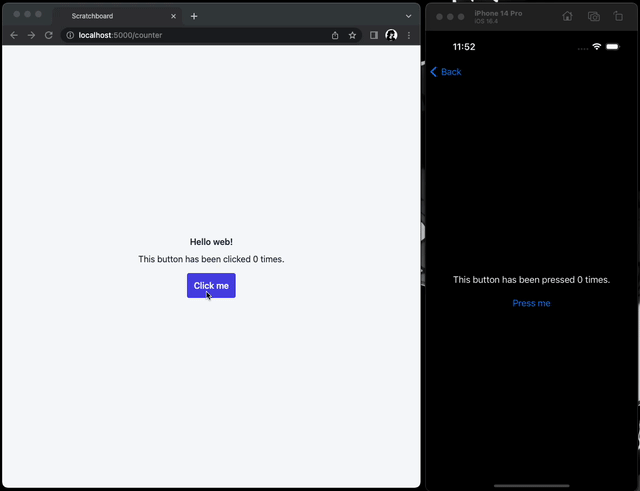
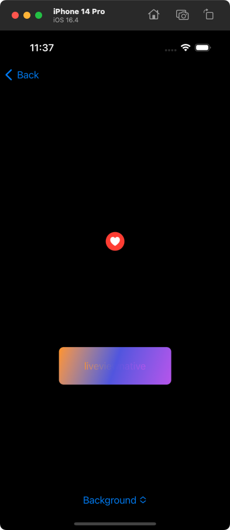

# Scratchboard

Scratchboard is an example project for [LiveView Native](https://github.com/liveview-native/). It is also a test bed for exploring new ideas when developing LiveView Native and its supporting libraries. It comprises of a simple Phoenix LiveView application that can serve both web clients and native iOS clients using the included Xcode project.

## Installation

To run Scratchboard locally, follow these steps:

  * Install dependencies with `mix deps.get`
  * Create and migrate your database with `mix ecto.setup`
  * Start Phoenix endpoint with `mix phx.server` or inside IEx with `iex -S mix phx.server`

The Scratchboard app can be used one of two ways:

  * In a web browser, by going to [`localhost:4000`](http://localhost:4000)
  * Using a native iOS client by building and running the Xcode project at `priv/native/ios/Scratchboard`

## About

Scratchboard includes a few pages for playing around with various features of LiveView Native:

### Counter Demo

On both the web and the iOS client, a multiplayer counter demo can be found at `/counter-demo`. Any client can press the button to increment the counter, which will be updated across all clients:

### SwiftUI Test Bed

On the iOS client, a catalogue of various SwiftUI components can be viewed at `/swift-ui-test-bed`:

## Learn more

  * Official website: https://native.live
  * Docs: https://hexdocs.pm/live_view_native
  * Source: https://github.com/liveviewnative/live_view_native
